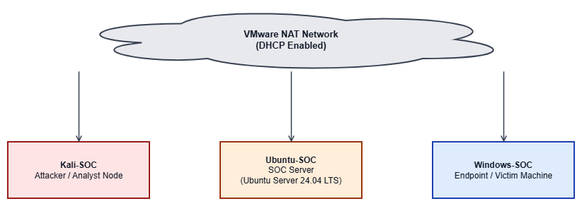

# SOC Lab -- End-to-End Threat Detection and Monitoring

A multi-phase Security Operations Center laboratory project that simulates real-world cyber attacks and implements detection and monitoring workflows using Splunk SIEM in a controlled virtualized environment.

---

## Project Overview

This project documents the design, deployment, and operation of a SOC laboratory built using VMware Workstation. The lab environment consists of three virtual machines configured to simulate attacker activity, generate authentication logs, and detect threats through centralized SIEM-based monitoring.

The project is structured into three phases:

1. **Infrastructure Deployment** -- Provisioning virtual machines, configuring networking, and establishing a validated baseline.
2. **Attack Simulation** -- Performing reconnaissance, executing SSH brute-force attacks, and generating authentication logs.
3. **Detection and Monitoring** -- Deploying Splunk SIEM, engineering detection rules, configuring alerts, and building dashboards.

---

## Objectives

- Build a functional multi-node SOC lab environment from scratch.
- Simulate realistic attack scenarios including service discovery and credential brute-forcing.
- Deploy a SIEM platform for centralized log collection and analysis.
- Engineer detection logic to identify SSH brute-force activity automatically.
- Configure alerting to notify on threshold-exceeding authentication failures.
- Create a monitoring dashboard for real-time visibility into authentication events.

---

## Architecture

### Lab Topology

| Machine | Operating System | Role | IP Address |
|---------|-----------------|------|------------|
| Kali-SOC | Kali Linux | Attacker / Security Analyst | 192.168.11.129 |
| Ubuntu-SOC | Ubuntu Server 24.04 LTS | Target / Log Source / SIEM Host | 192.168.11.128 |
| Windows-SOC | Windows 10 | Endpoint / Monitoring Node | DHCP |

### Infrastructure

| Parameter | Value |
|-----------|-------|
| Hypervisor | VMware Workstation |
| Network Mode | NAT (VMnet8) |
| Subnet | 192.168.11.0/24 |
| IP Assignment | DHCP |
| Resources per VM | 4 GB RAM, 2 CPU cores, 40 GB storage |

### Architecture Diagram



---

## Tools Used

| Tool | Purpose | Phase |
|------|---------|-------|
| VMware Workstation | Virtualization and lab hosting | Phase 1 |
| Nmap | Network reconnaissance and service discovery | Phase 2 |
| Hydra | SSH brute-force attack simulation | Phase 2 |
| journalctl | Local log review on Ubuntu Server | Phase 2 |
| Splunk Enterprise | SIEM platform for log ingestion, search, alerting, and dashboards | Phase 3 |

---

## Phase Breakdown

### Phase 1 -- Infrastructure Deployment

Phase 1 establishes the foundational lab environment. Three virtual machines were deployed on VMware Workstation under a NAT network configuration. Network connectivity was validated through ICMP ping tests between all nodes. OpenSSH Server was enabled on the Ubuntu Server to provide the primary attack surface for subsequent phases. Baseline snapshots were created for each VM to preserve clean rollback states.

**Documentation:** [Phase1-Infrastructure/phase-1.md](Phase1-Infrastructure/phase-1.md)

### Phase 2 -- Attack Simulation

Phase 2 introduces offensive security activity into the lab. Nmap was used from the Kali Linux machine to identify open services on the Ubuntu Server, discovering SSH on port 22 as the only exposed service. Hydra was then used to perform a dictionary-based brute-force attack against the `socadmin` account. The attack generated seven failed authentication attempts, all of which were recorded in the Ubuntu Server SSH logs. A successful login was subsequently confirmed after configuring a known credential.

**Documentation:** [Phase2-Attack-Simulation/phase-2.md](Phase2-Attack-Simulation/phase-2.md)

### Phase 3 -- Detection and Monitoring

Phase 3 deploys Splunk Enterprise on the Ubuntu Server to centralize log collection and automate threat detection. SSH authentication logs from `/var/log/auth.log` are ingested into Splunk and made searchable. A detection rule identifies brute-force activity by counting failed SSH login attempts per source IP. An alert is configured to trigger when the threshold is exceeded. A four-panel dashboard provides real-time visibility into authentication events.

**Documentation:** [Phase3-Detection-Monitoring/phase-3.md](Phase3-Detection-Monitoring/phase-3.md)

---

## Detection Logic

The brute-force detection rule identifies source IP addresses that generate five or more failed SSH authentication attempts. The threshold is based on the observation that legitimate users rarely exceed three failed attempts per session.

### SPL Query

```spl
index=main sourcetype=linux_secure "Failed password"
| rex "from (?<src_ip>\d+\.\d+\.\d+\.\d+)"
| stats count as failed_attempts by src_ip
| where failed_attempts >= 5
```

### Query Explanation

| Component | Purpose |
|-----------|---------|
| `index=main sourcetype=linux_secure "Failed password"` | Filters events to SSH authentication failures |
| `rex "from (?<src_ip>...)"` | Extracts the source IP address using regex |
| `stats count as failed_attempts by src_ip` | Counts failures per source IP |
| `where failed_attempts >= 5` | Applies the brute-force threshold |

---

## Dashboard

The Splunk dashboard ("SOC Lab - SSH Authentication Monitor") provides four panels for monitoring SSH activity:

| Panel | Description | Visualization |
|-------|-------------|---------------|
| Total Failed SSH Logins | Aggregate count of all failed authentication attempts | Single value |
| Failed Logins by Source IP | Breakdown of failed attempts per source IP | Table |
| Successful Logins | Timeline of accepted SSH connections with username and source IP | Table |
| Authentication Events Over Time | Volume of failed and successful events over time | Line chart |

---

## Screenshots

### Splunk Dashboard


### SSH Authentication Logs in Splunk


### Triggered Alert


### Attack Simulation Output


---

## Results

| Metric | Value |
|--------|-------|
| Attack Source IP | 192.168.11.129 (Kali Linux) |
| Target Service | SSH (port 22) |
| Target Account | socadmin |
| Total Failed Attempts | 7+ |
| Successful Compromise | 1 (after known credential was configured) |
| Detection Rule | Functional (correctly identified attacker IP) |
| Alert Status | Triggered successfully on brute-force activity |
| Dashboard | Operational with four panels |

The detection pipeline correctly identified `192.168.11.129` as the source of brute-force activity and triggered an alert without producing false positives during testing.

---

## Limitations

1. **Single log source.** Only SSH authentication logs are collected. A production SOC would aggregate logs from firewalls, endpoints, DNS, and applications.
2. **Co-located SIEM.** Splunk runs on the same host as the attack target. Production deployments require dedicated SIEM infrastructure.
3. **No log forwarding agents.** The Splunk Universal Forwarder is not deployed. Collection relies on local file monitoring.
4. **Static detection threshold.** The five-attempt threshold is fixed. Production systems would use adaptive baselines.
5. **No external alerting.** Alert actions are limited to internal Splunk logging. No email, webhook, or ticketing integrations are configured.
6. **Lab-scale data volume.** Detection logic has not been validated under production-level event volumes.

---

## Future Improvements

- Deploy the Splunk Universal Forwarder on Kali Linux and Windows to enable multi-host log collection.
- Integrate Windows Event Logs (Event ID 4625 for failed logons) into the SIEM pipeline.
- Implement email or webhook-based alert notifications.
- Add detection rules for additional attack types such as privilege escalation and lateral movement.
- Deploy a dedicated SIEM server to separate the monitoring infrastructure from the target systems.
- Introduce network-based detection using Suricata or Zeek for IDS/IPS capabilities.

---

## Repository Structure

```text
SOC-Lab/
|
|-- Phase1-Infrastructure/
|   +-- phase-1.md
|
|-- Phase2-Attack-Simulation/
|   +-- phase-2.md
|
|-- Phase3-Detection-Monitoring/
|   +-- phase-3.md
|
|-- screenshots/
|   |-- dashboard.png              # Phase 3: Splunk monitoring dashboard
|   |-- logs.png                   # Phase 3: SSH logs ingested into Splunk
|   |-- alert.png                  # Phase 3: Triggered brute-force alert
|   |-- attack.png                 # Phase 3: Kali Linux attack terminal
|   |-- nmap_scan.png              # Phase 2: Nmap service discovery
|   |-- hydra_attack.png           # Phase 2: Hydra brute-force output
|   |-- failed_logs.png            # Phase 2: Failed SSH log entries
|   +-- successful_login.png       # Phase 2: Confirmed SSH compromise
|
|-- diagrams/
|   +-- architecture.png
|
+-- README.md
```

---

## Project Checklist

### Phase 1 -- Infrastructure Deployment

| Task | Status |
|------|--------|
| Deploy Kali Linux VM (Attacker) | Completed |
| Deploy Ubuntu Server VM (Target / SIEM Host) | Completed |
| Deploy Windows 10 VM (Endpoint) | Completed |
| Configure NAT networking (VMnet8) | Completed |
| Validate inter-VM connectivity (ICMP ping) | Completed |
| Validate internet connectivity on all nodes | Completed |
| Enable OpenSSH Server on Ubuntu | Completed |
| Apply baseline system updates | Completed |
| Create clean-state snapshots for all VMs | Completed |

### Phase 2 -- Attack Simulation

| Task | Status |
|------|--------|
| Perform Nmap reconnaissance against Ubuntu Server | Completed |
| Identify exposed SSH service (port 22) | Completed |
| Execute Hydra brute-force attack against target account | Completed |
| Generate failed SSH authentication log events | Completed |
| Confirm successful SSH compromise in logs | Completed |
| Perform manual log analysis using journalctl | Completed |
| Quantify failed attempts and identify attacker IP | Completed |

### Phase 3 -- Detection and Monitoring

| Task | Status |
|------|--------|
| Install Splunk Enterprise on Ubuntu Server | Completed |
| Configure log ingestion from /var/log/auth.log | Completed |
| Verify SSH events are searchable in Splunk | Completed |
| Engineer SPL detection query for brute-force activity | Completed |
| Configure scheduled alert with threshold trigger | Completed |
| Re-execute attack simulation to validate detection | Completed |
| Confirm alert triggered on brute-force activity | Completed |
| Build four-panel SSH monitoring dashboard | Completed |
