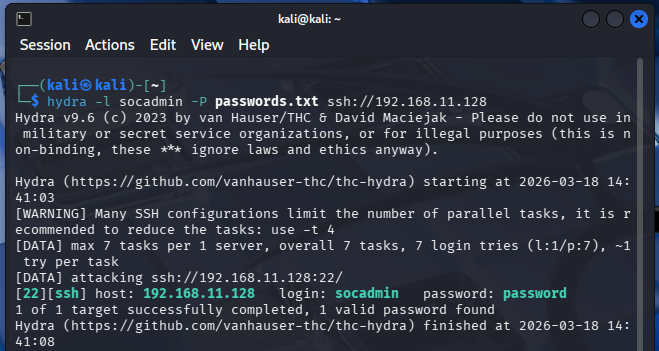

# 🛡️ SOC Lab Project – End-to-End Threat Detection

A structured, multi-phase Security Operations Center (SOC) lab built to simulate real-world cyber attacks and SOC detection workflows in a fully controlled virtualized environment.

---

## 📁 Repository Structure

```text
SOC-Lab/
│
├── Phase1-Infrastructure/          # VM setup, network config, baseline snapshots
│   └── phase-1.md
│
├── Phase2-Attack-Simulation/       # Nmap recon, Hydra brute-force, SSH attacks
│   └── phase-2.md
│
├── Phase3-Detection-Monitoring/    # SIEM integration, alerting, dashboards
│   └── (in progress)
│
├── screenshots/
│   ├── dashboard.png               # Nmap scan – open port discovery
│   ├── logs.png                    # Failed SSH login log entries
│   ├── alert.png                   # Successful compromise confirmation
│   └── attack.png                  # Hydra brute-force attack output
│
├── docs/
│   └── architecture.png            # SOC lab topology diagram
│
└── README.md
```

---

## 🧠 Overview

This repository documents a SOC lab environment built using **VMware Workstation**. The objective is to establish a stable infrastructure baseline and progressively implement logging, monitoring, and detection through structured phases.

| Node | Role |
|------|------|
| **Kali Linux** (`192.168.11.129`) | Attacker / Security Analyst |
| **Ubuntu Server** (`192.168.11.128`) | Target / Victim Machine |
| **Windows 10** | Endpoint / Monitoring Node |

---

## 🏗️ Architecture


| Parameter | Value |
|-----------|-------|
| Hypervisor | VMware Workstation |
| Network Mode | NAT |
| IP Assignment | DHCP |
| Resources | 4 GB RAM · 2 vCPU · 40 GB disk per VM |

---

## 📌 Phase Progress

| Phase | Description | Status |
|-------|-------------|--------|
| Phase 1 | Infrastructure Deployment & Baseline Configuration | ✅ Completed |
| Phase 2 | Attack Simulation (Recon + Brute-Force) | ✅ Completed |
| Phase 3 | Detection & Monitoring (SIEM / Splunk) | 🔄 In Progress |

---

## 🔴 Phase 2 – Attack Simulation

### 1. Reconnaissance (Nmap)

Nmap was run from Kali Linux to identify exposed services on the Ubuntu Server target.


*Nmap: open SSH port discovery on 192.168.11.128*

---

### 2. SSH Brute-Force (Hydra)

Hydra was used to simulate SSH password guessing against the Ubuntu Server target account.



*Hydra: dictionary-based SSH brute-force attack attempt*

---

### 3. Failed Login Detection

Multiple failed SSH authentication attempts were confirmed on Ubuntu Server using `journalctl`.


*journalctl: multiple failed authentication events from 192.168.11.129*

---

### 4. Successful Compromise

After a correct credential was identified, a successful SSH login was confirmed in the Ubuntu SSH logs.


*journalctl: Accepted SSH login — confirmed system compromise*

---

## 🔍 SOC Analysis Findings

- **Brute-force detected:** Multiple consecutive failed SSH authentication events from a single source IP.
- **Attacker IP identified:** `192.168.11.129` (Kali Linux node) across all failed attempts.
- **Compromise confirmed:** An `Accepted` SSH log entry verified successful unauthorized access.

---

## 📖 Phase Documentation

- 📄 [Phase 1 – Infrastructure](Phase1-Infrastructure/phase-1.md)
- 📄 [Phase 2 – Attack Simulation](Phase2-Attack-Simulation/phase-2.md)

---

## 🚀 Future Work (Phase 3)

- Deploy **Splunk / ELK Stack** for centralized log aggregation
- Build real-time **alert rules** for brute-force thresholds
- Create **dashboards** for attacker IP tracking and event timelines
- Integrate **Windows Event Logs** into SIEM pipeline

---

## 🧠 Key Learnings

- Validated attack paths and connectivity between lab hosts
- Used Nmap reconnaissance to identify exposed services and versions
- Generated real authentication events and confirmed log capture on the target
- Performed log triage to count failed attempts and identify attacker source IP
- Confirmed end-to-end compromise from Kali → Ubuntu

---

## ⚙️ Design Philosophy

The project follows a structured, phased engineering approach:

- Separate infrastructure setup from security testing
- Establish validated baselines before introducing attack complexity
- Preserve rollback states using structured VM snapshots
- Maintain clean, reproducible documentation at each stage
