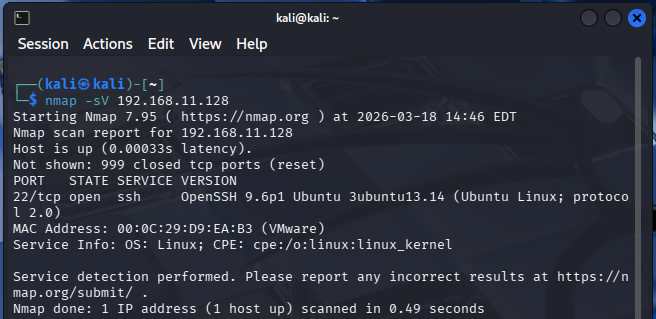
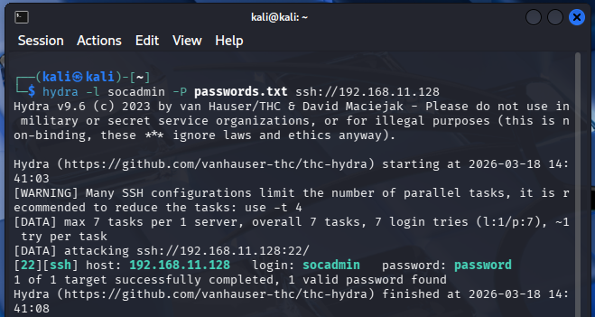
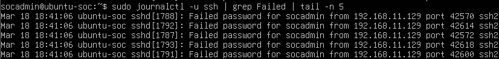
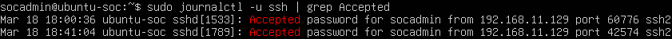

# Phase 2 – SIEM Setup and Log Collection

## 1. Phase Overview

Phase 2 focuses on generating and analyzing SSH authentication logs in the lab environment. The phase includes reconnaissance and brute-force activity from an attacker machine (Kali Linux) against a target log source (Ubuntu Server). Logs are recorded locally on the Ubuntu Server using `journald` and reviewed manually with `journalctl`.

Important scope note: a SIEM platform is **not installed in this phase**. Splunk is identified as the planned SIEM tool, but its installation is pending and intended for Phase 3.

## 2. Objectives

- Validate baseline network connectivity between attacker and target systems.
- Identify exposed services on the target host through reconnaissance.
- Generate authentication events (failed and successful SSH logins).
- Confirm that the target system records SSH authentication events.
- Perform manual log analysis to quantify attempts and identify the source IP.

## 3. SIEM Selection Justification

### Current Phase Status

- SIEM tool: **Not installed yet**
- Planned SIEM tool: **Splunk**
- Installation status: **Pending (to be implemented in Phase 3)**

### Justification (Planned)

Splunk is the planned SIEM tool for later phases. In Phase 2, the work is limited to local log generation and manual review.

No additional selection criteria (such as licensing, ingestion method, or indexing design) is documented for this phase.

## 4. Environment Details

### Lab Environment

| Item | Value |
|---|---|
| Virtualization | VMware Workstation |
| Network Mode | NAT (VMnet8) |
| Subnet | 192.168.11.0/24 |

### Machines Used

| Machine | OS | Role | IP Address |
|---|---|---|---|
| Attacker | Kali Linux | Attacker | 192.168.11.129 |
| Target | Ubuntu Server | Victim / Log Source | 192.168.11.128 |

## 5. Installation Process

### SIEM Installation

Not performed in Phase 2.

### Logging Components

Ubuntu Server logs were accessed locally via `journald` using `journalctl`.

## 6. Configuration Steps

### Network Configuration

- Network mode was set to NAT (VMnet8) within VMware Workstation.
- Both machines were placed in the same subnet: `192.168.11.0/24`.

### Connectivity Verification

Command used:

```bash
ping 192.168.11.128
```

Result:

- Successful communication between Kali and Ubuntu.

## 7. Log Collection Setup

### Log Source

- Host: Ubuntu Server (`192.168.11.128`)
- Service: SSH
- Logging system: `journald`

### Log Access Commands

Base log access:

```bash
journalctl -u ssh
```

Failed authentication events:

```bash
sudo journalctl -u ssh | grep Failed
```

Successful authentication events:

```bash
sudo journalctl -u ssh | grep Accepted
```

### Pre-SIEM Log Verification (Phase 2)

Before onboarding logs into a SIEM in a later phase, the log source can be verified locally to confirm that recent SSH events are present and readable from `journald`.

Example (show the most recent SSH log entries without paging):

```bash
sudo journalctl -u ssh -n 50 --no-pager
```

## 8. Data Flow Explanation

### Current Data Flow (Phase 2)

1. Kali Linux generates reconnaissance and SSH authentication traffic toward Ubuntu Server.
2. Ubuntu Server records SSH-related events locally in `journald`.
3. Logs are manually reviewed on Ubuntu Server using `journalctl` and command-line filters.

### Flow Summary

| Step | Source | Destination | Data |
|---|---|---|---|
| 1 | Kali (192.168.11.129) | Ubuntu (192.168.11.128) | Nmap scan and SSH authentication attempts |
| 2 | Ubuntu (192.168.11.128) | Ubuntu (`journald`) | SSH logs recorded locally |
| 3 | Ubuntu (manual review) | Ubuntu logs | `journalctl` queries and filtering |

Centralized log forwarding is not part of this phase.

## 9. Verification and Testing

### 9.1 Reconnaissance Verification

Tool:

- Nmap

Command:

```bash
nmap -sV 192.168.11.128
```

Result:

```
22/tcp open  ssh  OpenSSH 9.6p1 Ubuntu
```



Caption: Nmap: open SSH port discovery.

Observation:

- Only SSH (port 22) was open.
- SSH was identified as the primary attack surface for this phase.

### 9.2 Attack Simulation (Brute-Force)

Tool:

- Hydra

Wordlist used (`passwords.txt`):

```text
123456
password
admin
root
toor
kali
ubuntu
socadmin
```

Initial command:

```bash
hydra -l socadmin -P passwords.txt ssh://192.168.11.128
```

Initial result:

- `0 valid password found`



Caption: Hydra: brute-force attack attempt.

### 9.3 Log Generation and Detection (Failed Attempts)

Sample failed log entry observed:

```text
Failed password for socadmin from 192.168.11.129 port 40196 ssh2
```



Caption: Failed logs: multiple failed login attempts.

Count failed attempts:

```bash
sudo journalctl -u ssh | grep Failed | wc -l
```

Result:

- `7` failed attempts

Interpretation (documented logic):

- More than 5 failed attempts indicates brute-force activity.

Identify attacker IP frequency:

```bash
sudo journalctl -u ssh | grep Failed | awk '{print $11}' | sort | uniq -c
```

Result:

```text
7 192.168.11.129
```

Observation:

- All failed attempts originated from a single IP: `192.168.11.129`.

### 9.4 Successful Attack Simulation and Confirmation

Password set on Ubuntu for user `socadmin`:

- `password`

Password change command used:

```bash
passwd socadmin
```

Hydra re-run:

```bash
hydra -l socadmin -P passwords.txt ssh://192.168.11.128
```

Result:

```text
[22][ssh] host: 192.168.11.128 login: socadmin password: password
```

Confirm successful login in logs:

```bash
sudo journalctl -u ssh | grep Accepted
```

Result:

```text
Accepted password for socadmin from 192.168.11.129 port 60776 ssh2
```



Caption: Successful login: confirmed system compromise.

## 10. Challenges & Troubleshooting

### 10.1 No Valid Credentials (Initial Hydra Run)

- Symptom: Hydra returned `0 valid password found`.
- Action taken: The password for `socadmin` on Ubuntu was set to `password`, then Hydra was re-run.
- Outcome: Hydra successfully authenticated and the corresponding `Accepted` log entry was observed.

### 10.2 SIEM Not Available in Phase 2

- Constraint: No SIEM tool was installed or configured during this phase.
- Impact: Detection and analysis were performed manually using `journalctl`.

## 11. Learning Outcomes

- Practiced validating lab connectivity.
- Performed service discovery and version detection to identify the exposed service (SSH).
- Generated both failed and successful authentication events.
- Used command-line analysis to quantify events and identify the source IP responsible for repeated failures.
- Confirmed that logs exist and can be consistently queried with `journalctl`.

## 12. Conclusion

Phase 2 produced and verified SSH authentication logs from an attack simulation. Reconnaissance identified SSH as the only exposed service, Hydra generated both failed and successful authentication attempts, and Ubuntu Server recorded the events locally via `journald`. Manual analysis using `journalctl` confirmed the number of failed attempts, the attacker IP address, and the successful authentication event. SIEM installation remains pending for Phase 3.
